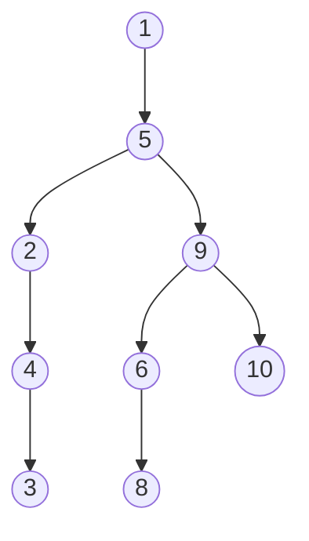

# Exercises

## Chapter 15. Speeding Up All the Things with Binary Search Trees

The following exercises provide you withe opportunity to practice with binary search trees. The
solutions to these exercises are found in the section, Chapter 15, on page 456.

1. Imagine you were to take an empty binary search tree and insert the following sequence of numbers
   in this order: [1,5,9,2,4,10,6,3,8] <br/> Draw a diagram showing what the binary search tree
   would look like. Remember, the numbers are being inserted in the order presented here.<br/>



2. If a well-balanced binary search tree contains 1000 values, what is the maximum number of steps
   it would take to search of a value within
   it?<br/>```The maximum number of stepts would be log(1000) = 10```
3. Write an algorithm that finds the greatest value within a binary search tree.
4. In the text I demonstrated how to use inorder traversal to print a list of all the book titles.
   Another way to traverse a tree is known as preorder traversal. Here is the code for it as applied
   to our book app: <br/>

````
def traverse_and_print(node)
   if node is None;
      return;
   print(node.value)
   traverse_and_print(node.leftChild)
   traverse_and_print(node.rightChild)   
````

For the example tree in the text (the one with Moby Dick and the other book titles), write out the
order in which the book titles are printed with preorder traversal. As a reminder, here is the
example tree as shown in the diagram on page 277

````mermaid
graph TD;
A[ Moby Dick ] --> B[ Great Expectations ]
A[ Moby Dick ] --> E[ Robinson Crusoe ]
E[ Robinson Crusoe ] --> F[ Pride and Prejudice ]
E[Robinson Crusoe ] --> G[ The Odyssey ]
B[ Great Expectations ] --> C[ Alice in Wonderland ]
B[ Great Expectations ] --> D[ Lord of the flies ]
````

``R: The order would be: Moby Dick, Great Expectations, Alice In wonderland, Lord of the Flies, Robinson Crusoe, Pride and Prejudice and The Odyssey``