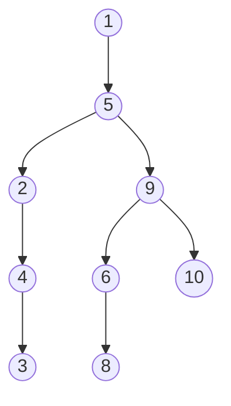

# Exercises

## Chapter 15. Speeding Up All the Things with Binary Search Trees

The following exercises provide you withe opportunity to practice with binary search trees. The
solutions to these exercises are found in the section, Chapter 15, on page 456.

1. Imagine you were to take an empty binary search tree and insert the following sequence of numbers
   in this order: [1,5,9,2,4,10,6,3,8]   Draw a diagram showing what the binary search tree
   would look like. Remember, the numbers are being inserted in the order presented here.
   Here is a simple flow chart:

