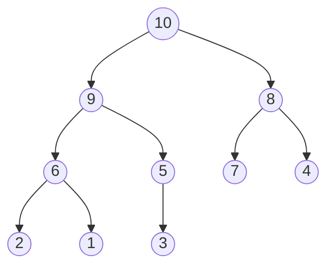
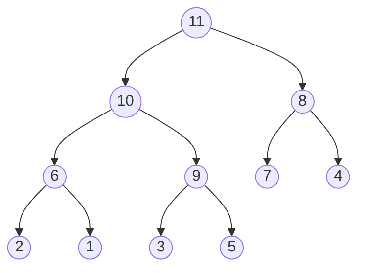
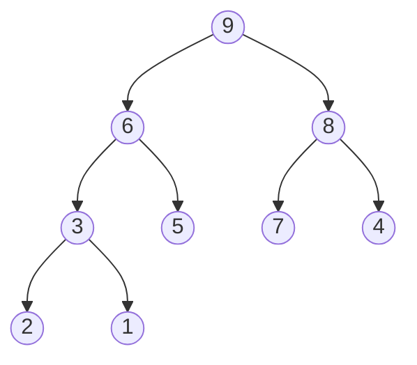

# Exercises

## Chapter 16. Keeping Your Priorities Straight with Heaps

The following exercises provide you withe opportunity to practice with heaps. The
solutions to these exercises are found in the section, Chapter 16, on page 458.

1. Draw what the following heap would look like after we insert the value 11 into it:

``R: ``

2. Draw what the previous heap would look like after we delete the root node

``R: ``

3. Imagine you've built a brand-new heap by inserting the following numbers into the heap in this
   particular order: 55, 22, 34, 10, 2, 99, 68. If you then pop them from the heap one at a time and
   insert the numbers into a new array, in what order would the numbers now appear?g