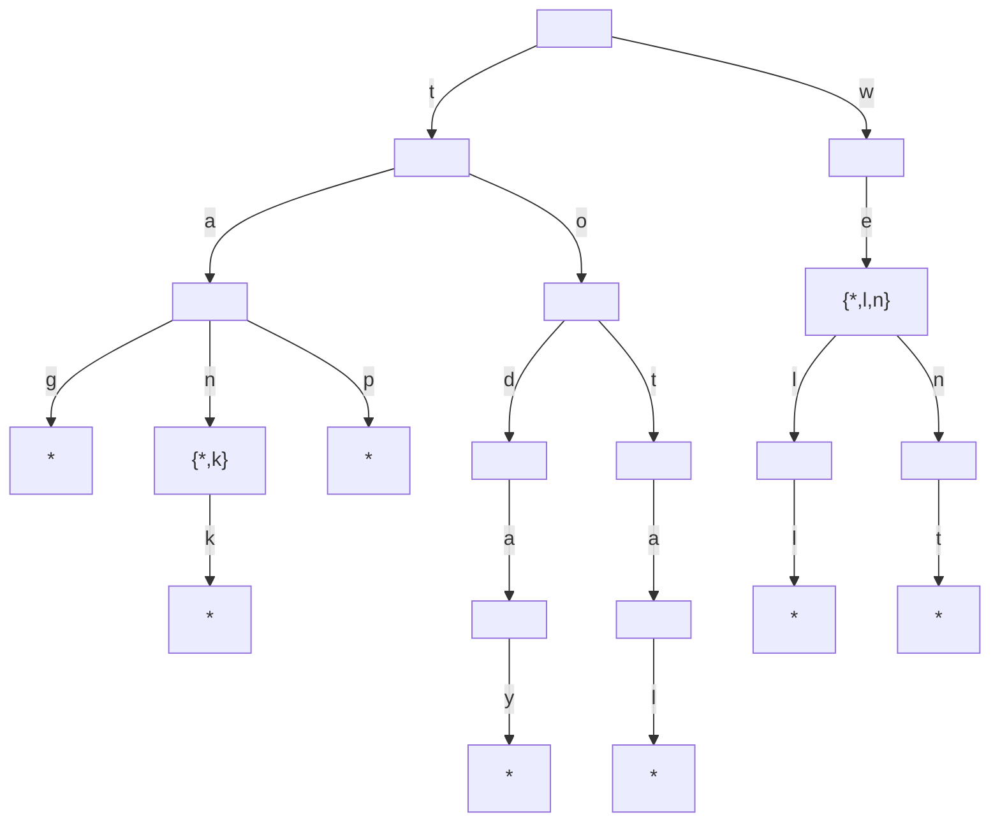
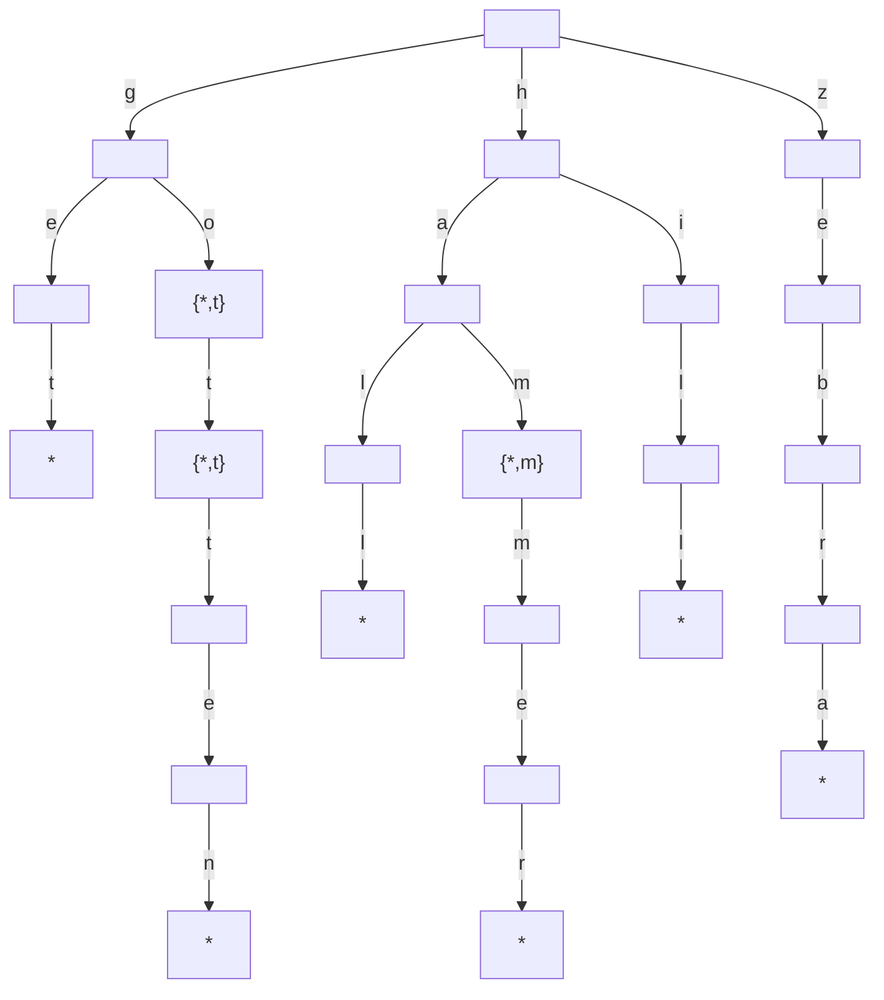

# Exercises

## Chapter 17. It Doesn't Hurt to Trie

The following exercises provide you withe opportunity to practice with tries. The
solutions to these exercises are found in the section, Chapter 17, on page 459.

1. List all the words stored in the following trie



``R: tag, tan, tank, tap, today, total, we, well, went``

2. Draw a trie that stores the following words: "get", "go", "got", "gotten", "hall", "ham", "
   hammer", "hill" and "zebra"



3. Write a function that traverses each node of a trie and prints each key, including all "*" keys;

````
   public void traverse() {
      for (Node node : root.children.values()) {
         traverse(node);
      }
   }

   private void traverse(Node node) {
      System.out.print(node.character);
      for (Node currentNode : node.children.values()) {
         traverse(currentNode);
      }
   }
````

4. Write an autocorrect function that attempts to replace a user's typo with a correct word. The
   function should accept a string that represents text a user type in. If the user's string is not
   in the trie, the function should return an alternative word that shares the longest possible
   prefix with the user's string. For example, let's say our trie contained the words "cat","
   catnap", and "catnip". If the user accidentally types in "catnar", our function should return "
   catnap", since that's the word from the trie that shares the longest prefix with "catnar". This
   is because both "catnar" and "catnap" share a prefix of "catna" which is five characters long.
   The word "catnip", isn't as good since it only shares the shorter, four-character prefix of "
   catn" with "catnar"<br/> One more example: if the user types in "caxasfdij", the function could
   return any of the words "cat", "catnap" and "catnip", since they all share the same prefix of "
   ca" with the user's typo<br/> If the user's string is found in the trie, the function should
   just return the word itself. This should be true even if the user's text is not a complete word,
   as we're only trying to correct typos, not suggest endings to the user's prefix.