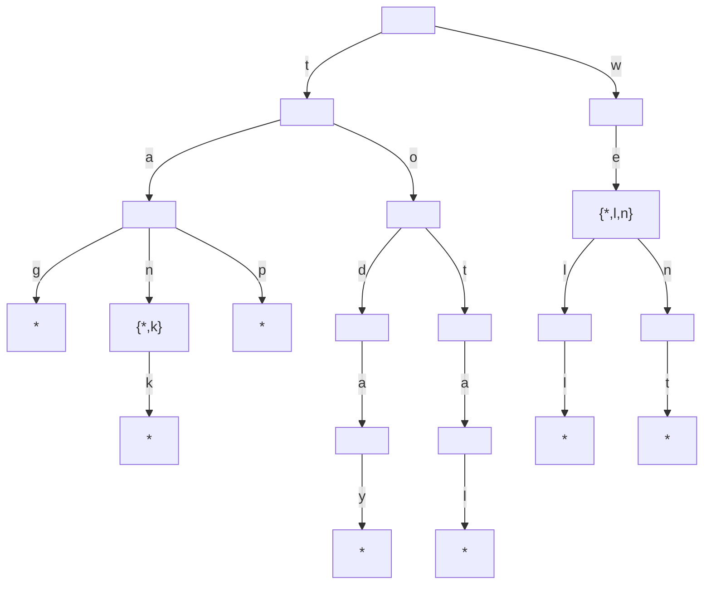
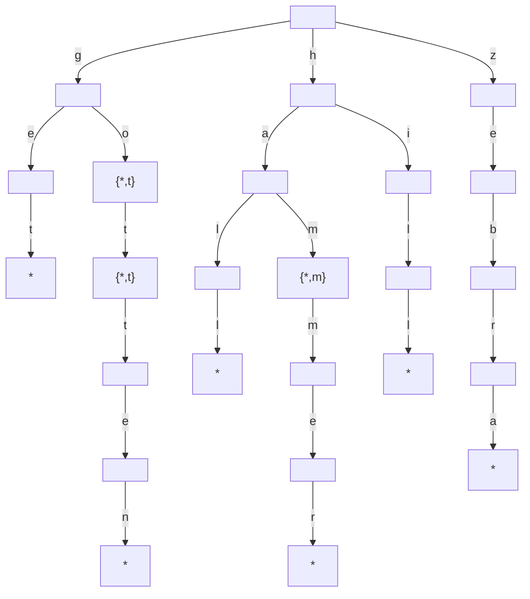

# Exercises

## Chapter 17. It Doesn't Hurt to Trie

The following exercises provide you withe opportunity to practice with tries. The
solutions to these exercises are found in the section, Chapter 17, on page 459.

1. List all the words stored in the following trie

``R: tag, tan, tank, tap, today, total, we, well, went``

2. Draw a trie that stores the following words: "get", "go", "got", "gotten", "hall", "ham", "
   hammer", "hill" and "zebra"

